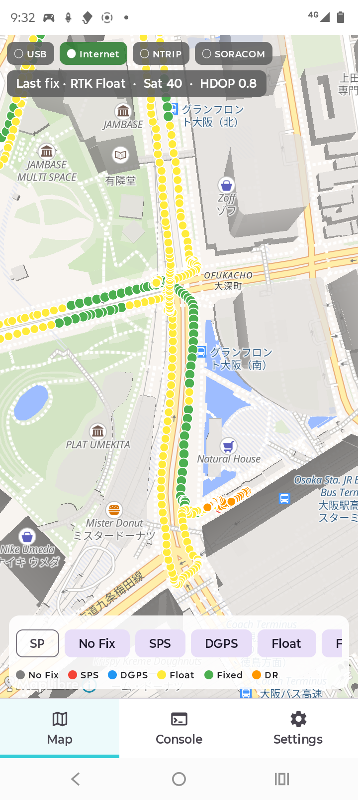
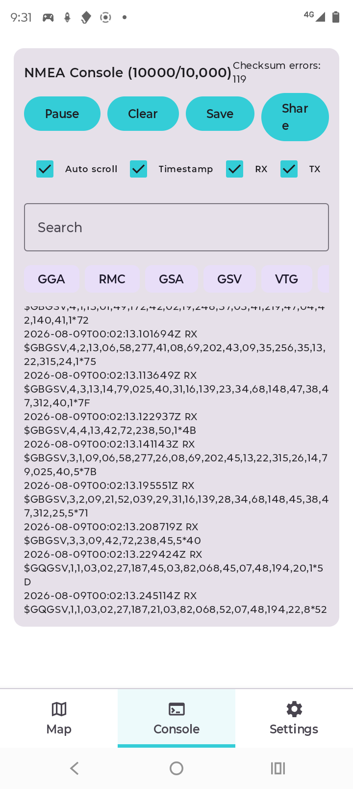
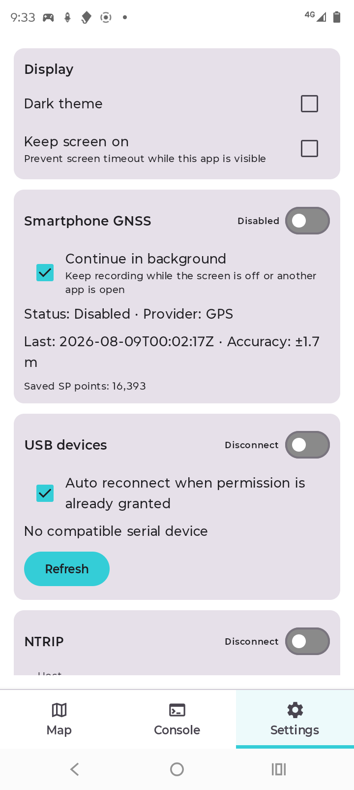

# QLM29H RTK Android

Quectel QLM29HBAA-GMをAndroid端末へUSB接続し、NTRIP補正を受信しながらGNSS/RTK測位状態と走行軌跡を確認・保存するためのアプリケーションです。保存した測位セッションデータは、Windows版QGNSS v2.5で再生できるNMEA/RTCMログとして共有/エクスポートできます。

本プロジェクトは現在、社内評価・研究開発向けの試作版です。一般消費者向け製品、測量成果を保証する機器、カーナビゲーションまたは運転支援システムではありません。

<p align="center">
  
  
  
</p>

## 想定する用途

- QLM29HのSPS/DGPS/RTK Float/RTK Fixed/DR状態の確認
- NTRIP補正データを使用したRTK測位の実機評価
- 測位点、品質別軌跡、セッション集計の記録
- Android端末自身のGNSS測位との参考比較
- SORACOM Unified Endpointへの測位情報送信試験
- セッションログのQGNSS v2.5または自作Viewerでの再解析

次の用途には使用しないでください。

- 人命や重大な損害に関係する安全制御
- 自動運転、運転支援、進路判断または交通規制判断
- 境界確定、法定測量その他の精度証明が必要な作業
- 測位結果だけを根拠とする機械・車両・ドローンの制御

## 動作条件

### Android端末

- Android 14（API level 34）以降
- USB Host/USB OTG対応
- USB機器と通信できるUSB Type-CケーブルまたはOTGアダプター
- アプリ、地図キャッシュ、走行ログを保存できる空き容量
- NTRIPおよび地図を利用できるモバイル通信またはWi-Fi

USB充電専用ケーブルでは通信できません。

### GNSS機器

- 動作確認済み: Quectel QLM29HBAA-GM
- USBシリアル設定: 115200 bps、8 data bits、no parity、1 stop bit
- 十分な上空視界を確保すること

USBシリアル機器の検出には`usb-serial-for-android`を使用しています。QLM29HBAA-GM以外のQuectel製品やUSB変換器は、一覧に表示されても正常動作を保証しません。

### 外部サービス

利用する機能に応じて、以下を各利用者が用意してください。

- RTK 補正情報サービスのアカウント
  - SORACOMなどで QLM29H 購入した際に発行され、Username、Passwordなどがメールで通知されます
- SORACOM Unified Endpointを利用する場合は、SORACOM Air for セルラー、または事前設定済みのSORACOM Arc接続
- OpenFreeMapへアクセスできるインターネット接続

地図表示にAPIキーは不要です。NTRIPアカウント、SORACOM契約、通信料金および各サービスの利用条件はアプリに含まれません。

### SORACOM Unified Endpointを利用する前の準備

Android端末からUnified Endpointへ送信するには、次のいずれかのSORACOM接続環境をアプリの利用前に準備してください。

- [SORACOM Air for セルラー](https://users.soracom.io/ja-jp/docs/air/)を利用する
- 任意のIPネットワークから[事前設定済みのSORACOM Arc](https://users.soracom.io/ja-jp/docs/arc/)を利用する

SORACOM Arcを使用する場合は、SORACOMの公式手順に従ってAndroid端末にWireGuardアプリケーションを導入し接続設定を完了してから、本アプリのSORACOM Unified Endpoint機能を有効にしてください。

送信データをSORACOM Harvest Dataなどで受け取る場合は、対象のSIMまたはArcのバーチャルSIM/Subscriberが所属するグループについて、利用する転送先も事前に設定します。Unified Endpointの役割と設定方法は、[Unified Endpointの機能](https://users.soracom.io/ja-jp/docs/unified-endpoint/feature/)および[Harvest Dataへデータを送信する手順](https://users.soracom.io/ja-jp/docs/unified-endpoint/funnel-and-harvest/)を参照してください。

## APKの入手と確認

社内評価版APKは、このPrivateリポジトリの[GitHub Releases](https://github.com/soracom-labs/qlm29h-gnss-rtk-android-app-sample/releases)でPre-releaseとして公開しています。リポジトリのRead権限を持つ社内GitHubアカウントでサインインし、最新の`Evaluation` Releaseを開いてください。

Releaseの`Assets`から、次の2ファイルを同じフォルダーへダウンロードします。

- `*-evaluation.*-debug.apk`: Androidへインストールする社内評価版アプリ
- `*.apk.sha256`: APKのSHA-256チェックサム

APKはソースコードのGit履歴には含めていません。ダウンロード前にRelease Notesで対応Androidバージョン、評価版であること、既知の制約を確認し、ダウンロード後はチェックサムが一致することを確認してください。

macOSまたはLinuxでの確認例:

```sh
shasum -a 256 -c qlm29h-rtk-0.1.0-evaluation.1-debug.apk.sha256
```

Windows PowerShellでの確認例:

```powershell
Get-FileHash .\qlm29h-rtk-0.1.0-evaluation.1-debug.apk -Algorithm SHA256
Get-Content .\qlm29h-rtk-0.1.0-evaluation.1-debug.apk.sha256
```

PowerShellでは、`Get-FileHash`の`Hash`と`.sha256`ファイル先頭の値が一致することを確認してください。APKの端末への導入方法は、後述の「Android端末の初期設定」を参照してください。

本リポジトリから評価APKを作成・配布する担当者は、[APK配布ガイド](docs/DISTRIBUTION.md)に従ってください。

## Android端末の初期設定

### 開発者モードは通常利用には不要

アプリをインストールした後、QLM29HをUSB接続して使用するだけであれば、Androidの開発者向けオプションやUSBデバッグは不要です。アプリが表示するUSBアクセス確認で許可してください。

開発者向けオプションとUSBデバッグが必要なのは、評価版APKをPCから`adb`でインストールまたはデバッグする場合です。会社管理のアプリ配布や、端末上で署名済みAPKをインストールする場合は別の配布手順に従ってください。

### ADBで評価版APKを導入する場合

1. Androidの「設定」から「端末情報」を開きます。
2. 「ビルド番号」を7回タップし、開発者向けオプションを有効にします。
3. 「システム」→「開発者向けオプション」から「USBデバッグ」を有効にします。
4. PCへ接続し、端末に表示されるPCのRSA鍵確認を許可します。
5. PCからAPKをインストールします。

```sh
adb devices
adb install -r app-debug.apk
```

メーカーにより設定項目の名称と場所は異なります。Googleの[Android開発者向けオプションの公式手順](https://developer.android.com/studio/debug/dev-options)も参照してください。

インストール後はUSBデバッグを無効にしても本アプリの通常機能には影響しません。不要になったUSBデバッグと開発者向けオプションは無効化し、PCのデバッグ許可も必要に応じて取り消してください。

### APKファイルを端末上で開いて導入する場合

配布元と署名を信頼できるAPKだけを使用してください。端末のファイル管理アプリやブラウザーから導入する場合、そのアプリに対して一時的に「不明なアプリのインストール」を許可する必要があります。インストール後は許可を戻し、Google Play Protectは有効なままにすることを推奨します。[Google Play Protectの説明](https://support.google.com/android/answer/2812853)

現在のデバッグAPKは評価用です。正式配布には、組織管理のリリース鍵による署名、バージョン管理および配布元の明示が必要です。

## 初回利用の流れ

1. アプリを起動し、通知権限を許可します。
2. QLM29HをAndroid端末へUSB接続します。
3. `Settings` → `USB devices`で対象機器を確認し、スイッチを`Connect`にします。AndroidのUSBアクセス確認が表示された場合は許可します。
4. `Settings` → `NTRIP`へ接続情報を入力して`Save`し、スイッチを`Connect`にします。
5. `Map`上部でUSBとNTRIPの状態を確認し、測位点と軌跡を表示します。
6. 必要な場合だけ、SORACOM接続を事前に準備してから`Settings` → `SORACOM Unified Endpoint`を有効にします。

`Map`下部では、表示する測位点と地図の追従を切り替えられます。

Map上部の`Internet`は、Androidがdefault networkの外部到達性を検証できた場合だけ緑になります。通信経路はあるものの検証中の場合は橙、経路がない場合は灰です。NTRIPとSORACOMの個別疎通は、それぞれ隣のステータスで確認してください。

- `SP`、`No Fix`、`SPS`、`DGPS`、`Float`、`Fixed`、`DR`のボタンをタップすると、該当する測位点を表示または非表示にできます。`SP`はSmartphone GNSS、その他はQLM29Hの測位品質を表します。この操作は地図上の表示だけを切り替え、測位データの取得・保存やNTRIP・SORACOMの動作は変更しません。
- `Follow`チェックボックスをオンにすると、新しい測位点に合わせて地図を自動的にセンタリングします。QLM29Hの測位点がある場合はQLM29Hを優先し、QLM29Hの測位点がない場合だけ`SP`を追従します。地図を自由に移動・拡大縮小したい場合は`Follow`をオフにします。

Smartphone GNSSは初期状態で無効です。参考比較が必要な場合だけ`Settings`から有効にし、位置情報権限を許可してください。走行中は端末を操作せず、設定変更は安全な場所に停車して行ってください。

## Android権限

| 権限・確認                       | 使用目的                                          | 必要になるタイミング                      |
| -------------------------------- | ------------------------------------------------- | ----------------------------------------- |
| USB機器へのアクセス              | QLM29Hとのシリアル通信                            | USB接続時                                 |
| 通知                             | USB/NTRIPまたはバックグラウンド測位の継続状態表示 | 初回起動時                                |
| 正確な位置情報                   | Smartphone GNSSの参考軌跡                         | Smartphone GNSSを初めて有効化するときだけ |
| インターネット・ネットワーク状態 | 地図、NTRIP、SORACOM送信                          | 各ネットワーク機能の利用時                |
| Foreground Service               | 画面消灯中や他アプリ表示中の継続動作              | USB接続中またはSPバックグラウンド取得中   |

Smartphone GNSSを使用しない場合、位置情報権限を許可する必要はありません。Smartphone GNSSの位置はNTRIP、SORACOM、Consoleへ送られず、QLM29Hの測位とは分離して保存されます。

## ネットワークとセキュリティ

- NTRIP接続はNTRIP v1とBasic認証を使用し、現行版にはTLS機能がありません。認証情報とGGAが暗号化されないため、信頼できる閉域網、VPNまたは適切に保護されたネットワークで使用してください。
- NTRIPのUsername/PasswordはAndroid Keystoreを利用して端末内で暗号化保存します。Host、Port、Mount Pointなどの一般設定はDataStoreへ保存します。
- SORACOM送信先は Unified Endpoint の HTTP エントリポイント `http://uni.soracom.io`に固定されています。Unified Endpoint はSORACOM Air for セルラーまたは事前設定済みのSORACOM ArcによるSORACOM接続環境からのみ接続可能です。
- SORACOM送信は初期状態で無効です。有効化時にUSB、最新Fix、送信結果を検証します。
- 広告SDK、利用状況分析SDK、外部クラッシュレポートSDKは組み込んでいません。

認証情報や秘密鍵をソースコード、Issue、スクリーンショットまたは共有ログへ含めないでください。

## 保存データとプライバシー

アプリは端末内に以下を保存します。

- QLM29Hの測位点と品質情報
- セッション開始・終了時刻と品質別集計
- QLM29Hから受信したNMEA生ログ
- NTRIPから受信したRTCM生ログ
- Smartphone GNSSを有効にした場合の参考位置と軌跡
- NTRIPおよび表示設定
- 表示済み地図リソースのキャッシュ

`Settings` → `Track cache`では、QLM29HとSmartphone GNSSの測位点について、保存上限を50,000、100,000、300,000点から選択できます。選択した上限はQLM29HとSPへそれぞれ独立に適用され、上限を超えた場合だけ古い測位点から削除されます。経過日数による自動削除はありません。上限を増やすほど端末ストレージの使用量が増え、過去セッションの地図表示が遅くなる場合があります。

この件数上限は地図表示・セッション参照用の測位点に対する設定です。QGNSSでの再生に使用するNMEA/RTCM生ログは対象外で、Track cacheとは別に管理・削除されます。

測位点、NMEAログ、共有したQGNSSログには正確な位置、移動経路、時刻が含まれます。これらは個人や車両の行動履歴になり得るため、個人情報と同等に慎重に管理してください。ログファイルの外部共有は、利用者が明示的にShare操作を行った場合だけ実行されます。NTRIP有効時のGGA送信とSORACOM有効時の測位情報送信は、前節のとおり別途発生します。

アプリ内の削除操作には確認ダイアログがあります。アンインストール、端末交換、Androidのバックアップや組織の端末管理におけるデータ保持方針は、配布組織と端末管理者の規則に従ってください。

アプリをアンインストールすると、測位点、セッション、設定、NTRIP認証情報、NMEA/RTCM生ログを含むアプリ内部データが削除されます。更新時は同じ署名鍵のAPKを上書きインストールし、アンインストールが必要な場合は、必要な各セッションのログを事前に共有・エクスポートしてください。Track cacheの測位点からGGA中心の再生ログを生成できる場合がありますが、削除された完全なNMEA/RTCM生ログを復元するものではありません。

## 既知の制約

- RTK Fixedへの移行や維持は、アンテナ、上空視界、基準局までの距離、補正内容、通信品質、速度、マルチパスなどに依存します。
- アプリのFixed/Float表示は受信したGGA Qualityを表し、座標の正しさや要求精度を保証するものではありません。
- OpenFreeMapの公開インスタンスにはSLAと個別サポートがありません。地図サービス停止中も測位・ログ保存は継続できますが、背景地図を表示できない場合があります。[OpenFreeMapのサービス説明](https://openfreemap.org/)
- 端末メーカー独自の省電力制御により、長時間のバックグラウンド動作が制限される場合があります。問題が発生した場合だけ、対象アプリのバッテリー設定を確認してください。
- QGNSS互換NMEAログはQGNSS v2.5で実機再生を確認済みです。RTCMログ単体は補正メッセージ解析用で、走行軌跡そのものではありません。
- 現行版のバージョンは`0.1.0`であり、設定・保存形式・UIが今後変更される可能性があります。

## 安全上の注意と免責

- 運転者は走行中に端末を操作しないでください。設定や確認は安全な場所に停車して行うか、同乗者が担当してください。
- GNSS、RTK、地図、モバイル通信および外部サービスは、常時利用可能または完全に正確であるとは限りません。
- 本ソフトウェアは評価・研究開発目的で現状有姿のまま提供され、特定目的への適合性、測位精度、連続稼働、データ完全性を保証しません。
- 利用者は、適用される交通法規、電波・通信、測量、個人情報、地図ライセンスおよび外部サービスの規約を確認し、自らの責任で使用してください。
- 本ソフトウェアの利用、測位誤差、通信断、ログ欠損または外部サービス停止により生じる判断や損害について、正式な配布条件と責任範囲は配布組織の契約・規程を優先します。

この節は技術プロジェクト上の暫定文面です。社外配布前に、配布主体の法務・セキュリティ・プライバシー審査を受けてください。

## 地図・第三者ソフトウェア

- 地図描画: [MapLibre Native](https://maplibre.org/projects/native/)（BSD 2-Clause）
- 地図配信・スタイル: [OpenFreeMap](https://openfreemap.org/)（公開インスタンス、SLAなし）
- 地図データ: [OpenStreetMap contributors](https://www.openstreetmap.org/copyright)（ODbL）
- QGNSS: Quectelが提供するWindowsアプリケーション。本リポジトリには同梱しません。

地図上の帰属表示はMapLibre経由で表示します。印刷物、動画、スクリーンショットその他の成果物で地図を利用する場合は、OpenFreeMapおよびOpenStreetMapの最新の帰属条件を確認してください。

Quectel、QLM29H、QGNSS、Android、SORACOM、MapLibre、OpenFreeMap、OpenStreetMapその他の製品名・サービス名は、各権利者の商標または登録商標です。

本アプリケーション自体の配布ライセンスを示す`LICENSE`ファイルは、現時点では未整備です。配布条件が正式決定されるまで、ソースコードやAPKの社外再配布が許諾されているとはみなさないでください。

## 問題報告時に含める情報

- アプリのバージョン
- Android端末名とAndroidバージョン
- GNSSモジュール名とファームウェアバージョン
- USB/NTRIP/SORACOMのどの段階で発生したか
- 再現手順と発生時刻
- 必要に応じて、位置や認証情報を除去したログ

NTRIP Password、Authorizationヘッダー、SORACOMの認証情報、正確な住所・座標をIssueやチャットへ貼らないでください。

## 開発・カスタマイズ資料

- `AGENTS.md`: AIおよび開発者が最初に読む変更ガイド
- `docs/REQUIREMENTS.md`: 要件ID付き現行要求
- `docs/ARCHITECTURE.md`: 責務とデータフロー
- `docs/DESIGN_DECISIONS.md`: 実機試験を踏まえた設計理由
- `docs/CUSTOMIZATION_GUIDE.md`: 安全なカスタマイズ方法
- `docs/TESTING.md`: 自動・実機・車載試験
- `docs/TRACEABILITY.md`: 要件から実装・テストへの索引
- `docs/DISTRIBUTION.md`: 評価APKと正式リリースの配布手順
- `qlm29h_android_app_spec.md`: 原初仕様。矛盾する場合は現行要求を優先

## 開発環境

- JDK 17
- Android SDK 35
- Android Gradle Plugin 8.5.2
- Gradle 8.7

```sh
./gradlew testDebugUnitTest
./gradlew assembleDebug
./gradlew lintDebug
```

社内評価用のバージョン付きAPKとSHA-256をまとめて生成する場合は、次を実行します。

```sh
./scripts/prepare-evaluation-release.sh
```

通常のデバッグAPKは`app/build/outputs/apk/debug/app-debug.apk`、配布候補は`dist/`へ生成されます。実装を変更する前に`AGENTS.md`と関連ドキュメントを確認してください。
