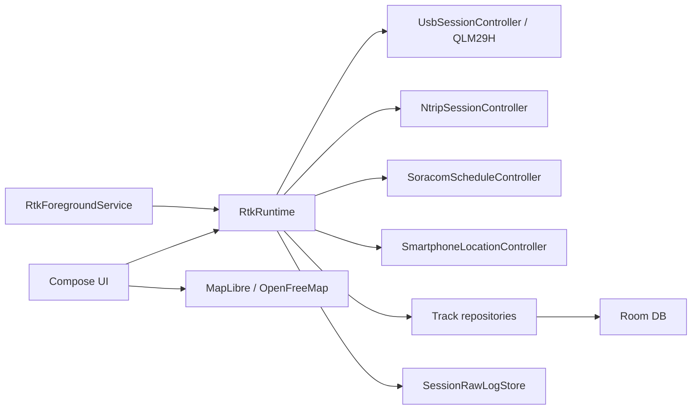
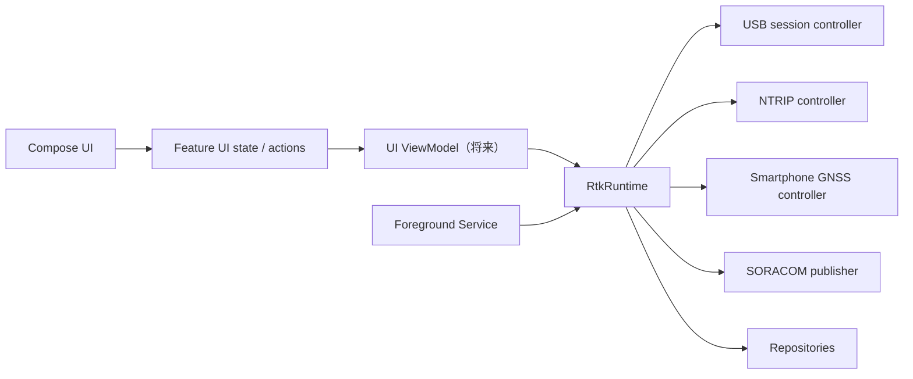

# アーキテクチャ

## 現在の構成

`RtkRuntime`はAndroid ViewModelではなく、`RtkApplication`が1インスタンスを所有する。Activity再生成中やForeground Service動作中もUSB/NTRIP処理を維持する。CoroutineScopeもRuntime自身のSupervisorJobに属し、テスト時は`shutdown()`で明示解放できる。

Runtimeの公開スナップショット`AppState`は機能別部分状態だけで構成する。Display、USB、NTRIP/RTCM、SORACOM、Smartphone GNSS、QLM測位・Map選択、Console/NMEA診断、一時通知を、それぞれの`App*State`へ分離している。更新時はネストした`copy`によって他機能の状態を維持する。

Runtimeの状態遷移は型で表す。USB、NTRIP、RTCM、SORACOM送信、Smartphone GNSS、設定保存、Source Table取得は、それぞれenumまたはsealed classをRuntime判断の正とする。`label`への文字列変換はUI投影とAndroid通知の境界だけで行う。NTRIPは完全接続の`isConnected`と、接続・再接続を含む`hasActiveSession`を区別する。Controllerから受け取ったイベントを文字列比較へ戻さない。

## 責務境界

- UI: 状態表示、入力、確認ダイアログ。通信規則を持たない。
- Runtime: USB、NTRIP、SORACOM、SPの状態遷移を調停する。
- Foreground Service: Androidへ継続動作を宣言し、Runtimeを所有しない。
- Repository: 保存、保持上限、セッション取得を担当する。
- Map: 与えられた表示モデルを描画し、通信や保存を行わない。

UIは`MainActivity.kt`をActivityライフサイクル、Runtimeとの接続、タブシェルに限定し、Mapを`ui/map/MapScreen.kt`、Settingsを`ui/settings/SettingsScreen.kt`へ分離している。`MainScreen`もRuntimeそのものではなく、投影済み状態と操作境界だけを受け取る。新しい設定カードをActivityへ戻さない。

Mapは`MapUiState.from(AppState)`で必要な状態だけを投影し、`MapActions`だけを受け取る。Settingsも`SettingsUiState.from(AppState)`でDisplay、SP、USB、NTRIP、SORACOM、Storage、Sessions、Diagnosticsへ投影し、各カードは担当する機能状態だけを受け取る。操作は`SettingsActions`を受け取り、`RtkSettingsActions`がRuntimeへ委譲する。画面Composableは`RtkRuntime`の具象型や`AppState`全体を参照しない。

権限や入力値の組合せ判断は、`ForegroundServicePolicy`、`SmartphoneGnssPolicy`、`SettingsValidator`のようなAndroid非依存の純粋ロジックを経由する。プラットフォームクラスは判断結果を実行するだけにする。

長寿命Coroutineの所有者も分離している。`UsbSessionController`はUSB受信Job、`NtripSessionController`は単一ストリーム・再接続待機・キャンセル、`SoracomScheduleController`は定期送信タイマーを所有する。`SmartphoneLocationController`はLocationProvider登録を所有し、重複start/stopを防ぐ。`RtkRuntime`は結果を`AppState`へ反映するが、Controller内部のJobや登録状態を直接操作しない。

## データフロー

QLMは `USB → SessionRawLogStore → NMEA framing/checksum → GGA parsing → TrackRepository` の順に保存される。同じ最新GGAがNTRIPとSORACOMで利用される。RTCMは `NTRIP → SessionRawLogStore → inspector → USB` であり、内容を改変しない。

`SessionRawLogStore`はUSBセッションIDごとのディレクトリへNMEA RXとRTCM RXを別々に保存する。構造化されたTrackPointは高速なMap表示用、生ログは外部リプレイと将来の再解析用であり、片方からもう片方を完全再構成できるとはみなさない。QGNSS向け共有ファイルへアプリの時刻やRX/TXラベルを混ぜない。導入前のセッションだけは`rawGga`からGGA-onlyログを生成する。

TrackPointの保存上限は`AppStorageState`とDataStoreへ保持し、QLMとSPの各Repositoryへ同じ選択値を独立に適用する。保持は件数だけで制御し、経過日数では削除しない。上限変更時の即時trimと新規保存時のtrimはRepositoryが担当し、生NMEA/RTCMログには適用しない。

SPは `Android GPS Provider → AppSmartphoneState / SmartphoneTrackRepository → SP Map layer` の閉じた経路である。QLM経路へ合流させてはならない（`SP-01`, `SP-02`）。

## Mapの表示モデル

- Live: `AppTrackingState.livePoints`と最新SP集合。
- Past session: `AppTrackingState.selectedSessionPoints`の全点。SPは非表示。
- Viewport判断は`MapViewportPolicy`へ集約し、MapLibreなしで試験する。
- レイヤー再描画キャッシュは`MapRenderState`が保持する。

## 今後の目標構成

この分離は挙動保護テストを追加した後に行い、依存更新や新機能と同時に実施しない。
