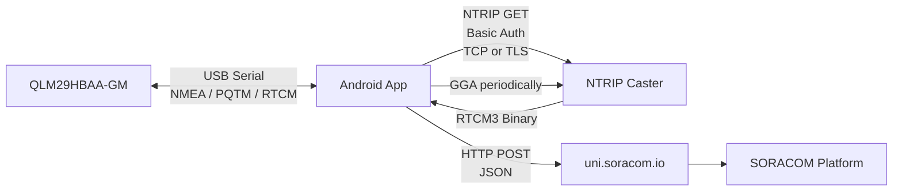
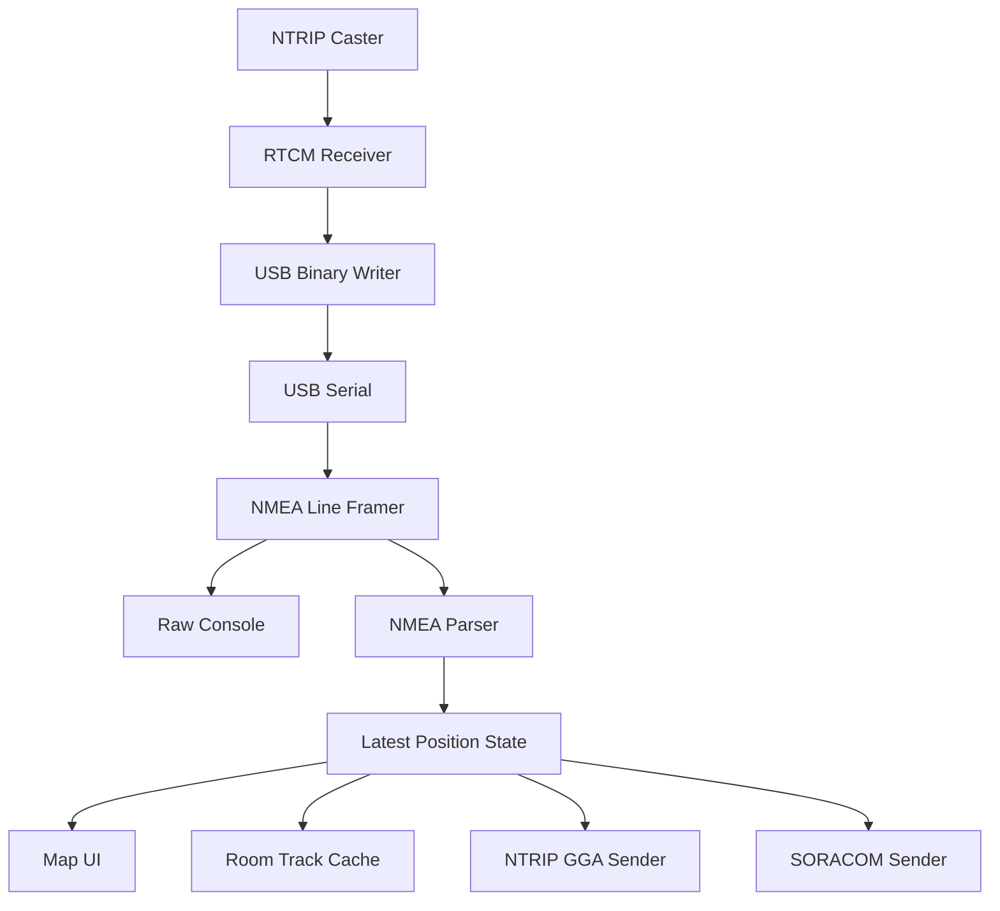

# QLM29H RTK Android Application 仕様書

- 文書種別: ソフトウェア仕様書
- 対象: Android 14 以降
- 対象デバイス: Quectel QLM29HBAA-GM（USBモデル）
- 実装想定: Kotlin / Jetpack Compose
- 初版: 2026-08-05

---

## 1. 目的

本アプリケーションは、Android端末にUSB接続されたQuectel QLM29HBAA-GMからGNSSデータを取得し、NTRIPによるRTK補正、NMEA生データの確認、測位品質別の地図表示、ならびにSORACOM Unified Endpointへの定期送信を行う。

利用者はコマンドライン操作を行わず、Androidアプリの画面から以下を実行できる。

1. QLM29HBAA-GMのUSB接続とシリアル通信開始
2. NTRIP Casterの設定と接続
3. QLM29HBAA-GMが出力するNMEAデータのリアルタイム確認
4. NTRIP Casterから受信したRTCM補正データのQLM29HBAA-GMへの注入
5. 現在位置および移動軌跡の地図表示
6. GGA Qualityごとの測位点の色分け
7. 測位データのSORACOM Unified Endpointへの定期送信
8. 地図タイルと測位軌跡の一定量のローカルキャッシュ

---

## 2. 対象範囲

### 2.1 対象

- Android 14（API Level 34）以降
- USB Host対応Android端末
- Quectel QLM29HBAA-GM USBモデル
- NTRIP v1.0
- NTRIP over TCP
- NTRIP over TLS
- NMEA 0183
- RTCM 3.x
- SORACOM Unified Endpoint
- SORACOM SIMによるセルラー接続
- SORACOM Arcによる接続
- オンライン地図とローカルタイルキャッシュ

### 2.2 対象外

- QLM29HCAA-GM
- RS-232モデル
- 他のQuectel GNSS製品
- 一般的なUSB GPS全般への対応
- iOS
- Android 13以前
- NTRIP Caster機能
- NTRIP Server機能
- Base Stationモード
- SORACOM送信失敗データの再送
- 任意地域の地図事前ダウンロード
- クラウド側の可視化画面
- ユーザー認証基盤
- ファームウェア更新機能

---

## 3. システム構成



---

## 4. 基本動作フロー

1. 利用者がQLM29HBAA-GMをAndroid端末へUSB接続する。
2. AndroidがUSBデバイスを検出する。
3. 初回接続時はUSBアクセス許可ダイアログを表示する。
4. アプリがUSBシリアルポートを115200 bpsで開く。
5. アプリがNMEA受信を開始する。
6. アプリは必要に応じてQLM29HBAA-GMへRTK有効化コマンドを送信する。
7. 利用者がNTRIP接続を開始する。
8. アプリがNTRIP Casterへ接続する。
9. アプリはQLM29HBAA-GMから得た最新GGAをNTRIP Casterへ定期送信する。
10. アプリはNTRIP CasterからRTCM補正データを受信する。
11. アプリはRTCMバイナリを加工せずQLM29HBAA-GMへ転送する。
12. QLM29HBAA-GMのGGA QualityがRTK FloatまたはRTK Fixedへ変化する。
13. アプリは現在位置、測位品質、軌跡を画面へ反映する。
14. 設定された周期で最新の測位データを`http://uni.soracom.io`へPOSTする。

---

## 5. 技術要件

### 5.1 Android

- 対応OS: Android 14以降
- `minSdk`: 34
- 実装言語: Kotlin
- UI: Jetpack Compose
- 非同期処理: Kotlin Coroutines / Flow
- バックグラウンド処理: Foreground Service
- ローカルDB: Room
- 設定保存: DataStore
- 認証情報保護: Android Keystore
- HTTP通信: OkHttpを推奨
- JSON: kotlinx.serializationを推奨

### 5.2 Foreground Service

以下の処理はActivityではなくForeground Serviceが管理する。

- USB接続
- シリアル通信
- NMEA受信
- PQTMコマンド送信
- NTRIP接続
- GGA送信
- RTCM受信
- RTCM転送
- SORACOM定期送信
- 軌跡保存
- ログ記録

画面回転、Activity再生成、バックグラウンド遷移で通信処理を停止させない。

### 5.3 常駐通知

Foreground Service実行中は通知を表示する。

表示例:

```text
QLM29H RTK
USB: Connected
NTRIP: Connected
Fix: RTK Fixed
```

通知には「停止」アクションを設ける。

---

## 6. USB・シリアル通信仕様

### 6.1 USB認識

QLM29HBAA-GMは、Android接続時にUSBシリアルデバイスとして利用できる前提とする。

必須要件:

- Android USB Host APIでUSBデバイスを列挙する
- USBアクセス許可を取得する
- 特別なAndroidドライバのインストールを要求しない
- root権限を要求しない
- USB接続・切断イベントを検出する
- USB再接続時に通信を復旧できる
- 複数USBシリアルデバイスが存在する場合は選択画面を表示する

### 6.2 接続パラメータ

| 項目 | 値 |
|---|---:|
| Baud rate | 115200 bps |
| Data bits | 8 |
| Parity | None |
| Stop bits | 1 |
| Flow control | None |

### 6.3 デバイス判定

VID/PIDに固定依存しない。

判定手順:

1. USBシリアルデバイスを列挙する
2. 対応可能なポートを開く
3. 115200 bpsで受信を開始する
4. NMEAまたはPQTMメッセージの受信を確認する
5. 必要に応じて`PQTMVERNO`を送信し、応答からQLM29H系デバイスであることを確認する

### 6.4 表示するデバイス情報

- USBデバイス名
- Vendor ID
- Product ID
- シリアルドライバ種別
- 接続状態
- ボーレート
- 受信バイト数
- 送信バイト数
- 最終受信時刻
- 最終送信時刻

### 6.5 切断・再接続

USB切断時:

- 状態を`Disconnected`に変更する
- NTRIP接続を停止する
- SORACOM送信を一時停止する
- Foreground Serviceは接続待ち状態を維持する

USB再接続時:

1. USBアクセス許可を確認する
2. シリアルポートを開く
3. NMEA受信を再開する
4. QLM29H初期化処理を再実行する
5. 自動再接続が有効ならNTRIP接続を再開する

---

## 7. QLM29H初期化仕様

### 7.1 RTK有効化

接続後、設定に応じて以下のPQTMコマンドを送信する。

```text
$PQTMCFGRTK,W,1,1*<CHECKSUM>\r\n
```

### 7.2 NMEAチェックサム

- `$`と`*`の間にある全ASCII文字をXORする
- 結果を2桁の16進数大文字で表現する
- 末尾に`\r\n`を付加する

### 7.3 初期化設定

以下を設定可能にする。

- RTK初期化の自動実行: ON/OFF
- 初期化コマンド送信後の待機時間
- 初期化成功応答の監視
- 初期化コマンドの再送回数

MVPでは初期値を以下とする。

| 項目 | 初期値 |
|---|---:|
| 自動初期化 | ON |
| 応答待ち | 1秒 |
| 再送回数 | 1回 |

---

## 8. NTRIP仕様

### 8.1 対応方式

- NTRIP v1.0
- HTTP GET
- Basic認証
- TCP
- TLS
- Source Table取得
- GGA定期送信
- RTCM3バイナリ受信

### 8.2 設定項目

| 項目 | 必須 | 初期値 |
|---|---:|---|
| Host | 必須 | 設定値 |
| Port | 必須 | 2101 |
| Mount Point | 必須 | AUTO |
| Username | 条件付き必須 | 空 |
| Password | 条件付き必須 | 空 |
| TLS | 必須 | OFF |
| GGA送信間隔 | 必須 | 1秒 |
| 接続タイムアウト | 必須 | 10秒 |
| 再接続 | 必須 | ON |
| 再接続間隔 | 必須 | 5秒 |

### 8.3 TLS

- TLS利用可否を設定画面で切り替えられる
- TLS有効時はAndroid標準のTLS実装を利用する
- サーバー証明書を検証する
- ホスト名検証を行う
- 自己署名証明書を無条件に許可しない
- 証明書エラー時は接続を失敗させ、内容を画面へ表示する

QLM29H自身はTLS処理を行わない。AndroidアプリがNTRIP CasterとのTLS接続を終端し、復号済みのRTCMバイナリをUSB経由でQLM29Hへ転送する。

### 8.4 NTRIPリクエスト

例:

```http
GET /<MOUNT_POINT> HTTP/1.0
User-Agent: NTRIP AndroidClient/1.0
Host: <HOST>
Accept: */*
Connection: close
Authorization: Basic <BASE64_USER_PASSWORD>
```

### 8.5 接続成功判定

以下を接続成功として扱う。

- `ICY 200 OK`
- HTTP `200 OK`

それ以外は接続失敗として扱う。

### 8.6 Source Table

- NTRIP Source Tableを取得できる
- 取得したMount Pointを一覧表示できる
- Mount Pointを選択できる
- 手入力も可能とする
- Source Table取得失敗時はエラーを表示する

### 8.7 GGA送信

- QLM29Hから最後に受信した有効なGGAを保持する
- 設定された周期でNTRIP Casterへ送信する
- GGAが未取得の場合は送信しない
- No FixのGGAをCasterへ送るかどうかはNTRIP Caster互換性を優先し、初期実装では受信した最新GGAを送信する
- 送信したGGA、送信時刻、QualityをNTRIPログへ記録する

### 8.8 RTCM受信・転送

- RTCM3をバイナリとして受信する
- 文字列変換しない
- 受信データを加工せずUSBシリアルへ書き込む
- RTCM受信バイト数を表示する
- 最終RTCM受信時刻を表示する
- 一定時間RTCMを受信しなければ`Stale`状態にする

初期値:

```text
RTCM Stale判定: 最終受信から10秒
```

### 8.9 RTCMメッセージID表示

可能な場合、RTCMヘッダーを解析して以下を表示する。

| ID | ラベル |
|---:|---|
| 1005 | Reference station coordinates |
| 1033 | Receiver / antenna description |
| 1074 | GPS MSM4 |
| 1084 | GLONASS MSM4 |
| 1094 | Galileo MSM4 |
| 1124 | BDS MSM4 |
| その他 | msg#<ID> |

CRC検証はMVPでは任意とする。

---

## 9. NMEA仕様

### 9.1 対応センテンス

最低限、以下を識別する。

- GGA
- RMC
- GSA
- GSV
- VTG
- GLL
- ZDA
- GST
- PQTM
- その他

位置情報、Quality、衛星数、HDOP、標高の取得にはGGAを利用する。

### 9.2 NMEA構造

標準NMEAは以下の構造を持つ。

```text
$<Address>,<Data Fields>*<Checksum>\r\n
```

チェックサムは`$`と`*`の間の文字列に対する8-bit XORである。

### 9.3 GGA解析

GGA形式:

```text
$<TalkerID>GGA,<UTC>,<Lat>,<N/S>,<Lon>,<E/W>,<Quality>,
<NumSatUsed>,<HDOP>,<Alt>,M,<Sep>,M,<DiffAge>,<DiffStation>*<Checksum>
```

解析項目:

| 項目 | 内容 |
|---|---|
| UTC | 測位UTC |
| Latitude | 緯度 |
| Longitude | 経度 |
| Quality | 測位品質 |
| Satellites | 使用衛星数 |
| HDOP | 水平精度低下率 |
| Altitude | 平均海面からの標高 |
| Geoid Separation | ジオイド高 |
| Differential Age | 補正情報経過時間 |
| Differential Station ID | 基準局ID |
| Raw GGA | 元のGGAセンテンス |

### 9.4 Quality定義

| Quality | ラベル | 意味 |
|---:|---|---|
| 0 | No Fix | 測位不可または無効 |
| 1 | GPS SPS | 単独測位 |
| 2 | DGPS / SBAS | DGPS、SPS補正、SBAS |
| 4 | RTK Fixed | RTK整数解 |
| 5 | RTK Float | RTK浮動解 |
| 6 | Dead Reckoning | 推測航法 |

Quality 3および未定義値は`Unknown(<value>)`として扱う。

### 9.5 座標変換

NMEA座標を十進数度へ変換する。

緯度:

```text
ddmm.mmmmmm
```

経度:

```text
dddmm.mmmmmm
```

変換式:

```text
decimal_degrees = degrees + minutes / 60
```

南緯（S）および西経（W）は負値とする。

### 9.6 チェックサム検証

- 受信したNMEAのチェックサムを検証する
- 正常なGGAのみ位置更新に利用する
- チェックサム不正のセンテンスも生ログには表示する
- チェックサム不正件数を統計表示する

---

## 10. NMEAコンソール仕様

### 10.1 基本表示

シリアルコンソールの`tail -f`に近い画面とする。

必須機能:

- リアルタイム表示
- 等幅フォント
- 自動スクロール
- 自動スクロールON/OFF
- Pause/Resume
- Clear
- タイムスタンプ表示ON/OFF
- RX/TXの識別
- フィルタ
- 文字列検索
- コピー
- ログ保存
- Android共有

### 10.2 表示保持数

```text
最大10,000行
```

上限超過時は古い行から破棄する。

Pauseは画面更新のみ停止し、USB受信、NTRIP処理、SORACOM送信は停止しない。

### 10.3 フィルタ

以下を個別にON/OFFできる。

- GGA
- RMC
- GSA
- GSV
- VTG
- GLL
- ZDA
- GST
- PQTM
- その他
- RX
- TX
- チェックサムエラー

### 10.4 ログ保存

- 保存形式: UTF-8テキスト
- 改行: LFまたはCRLF
- ファイル名に日時を含める
- アプリプライベートストレージへ保存する
- Android共有機能で外部へ渡せる

---

## 11. 測位ステータス表示

常時表示する項目:

- USB接続状態
- NTRIP接続状態
- RTCM受信状態
- 現在のQuality
- Quality Label
- 緯度
- 経度
- 標高
- 使用衛星数
- HDOP
- 最終GGA時刻
- 最終RTCM受信時刻
- 最終SORACOM送信時刻
- 最終HTTPステータス

状態例:

| 項目 | 状態 |
|---|---|
| USB | Disconnected / Connecting / Connected / Error |
| NTRIP | Disconnected / Connecting / Connected / Reconnecting / Auth Error / TLS Error |
| RTCM | None / Receiving / Stale |
| SORACOM | Disabled / Idle / Sending / Success / Failed |

---

## 12. 地図仕様

### 12.1 基本機能

- 現在位置表示
- 軌跡表示
- ピンチズーム
- パン
- 現在位置へ戻る
- 自動追従ON/OFF
- 地図回転ON/OFF
- Quality凡例
- Qualityフィルタ
- 軌跡クリア
- 測位点タップ時の詳細表示

### 12.2 測位点データ

各測位点は以下を保持する。

```text
id
session_id
timestamp
latitude
longitude
altitude
quality
quality_label
satellites
hdop
ntrip_connected
last_rtcm_received_at
raw_gga (optional)
```

### 12.3 地図追加周期

地図への測位点追加周期をSORACOM送信周期とは独立して設定する。

選択肢:

- 全GGA
- 1秒
- 2秒
- 5秒
- 10秒

初期値:

```text
1秒
```

### 12.4 Quality別表示

Qualityごとに異なる色を使用する。

色だけでなく、凡例、テキストラベル、縁取りを併用する。

### 12.5 地図タイルキャッシュ

- 一度表示した地図タイルをローカルへ保存する
- キャッシュ済み範囲はオフラインでも表示できる
- 最大容量: **200 MB**
- LRU方式で古いタイルから削除する
- アプリプライベートストレージへ保存する
- 使用量を設定画面で確認できる
- ユーザーが一括削除できる
- 任意地域の事前ダウンロードはMVP対象外

設定表示例:

```text
地図キャッシュ
使用量: 84 MB / 200 MB
[キャッシュを削除]
```

### 12.6 地図タイル配信元

実装時に選定する。

選定条件:

- OpenStreetMap互換
- Android 14対応
- タイルキャッシュ制御が可能
- Composeと統合可能
- 商用または検証用途に適合する利用規約
- 公共のOSM標準タイルへ過度な負荷をかけない

---

## 13. 軌跡キャッシュ仕様

### 13.1 保存方式

Roomデータベースへ保存する。

### 13.2 保持上限

以下のうち先に到達した条件で古いデータを削除する。

- 最大50,000ポイント
- 最大7日間

### 13.3 セッション管理

測位開始から停止までを1セッションとして管理する。

セッション項目:

```text
session_id
started_at
ended_at
point_count
rtk_fixed_count
rtk_float_count
sps_count
dgps_count
dead_reckoning_count
```

### 13.4 軌跡削除

- 現在セッションの軌跡クリア
- 過去セッション単位の削除
- 全履歴削除

### 13.5 SORACOM送信との関係

軌跡キャッシュは地図表示用である。

- SORACOM送信失敗時の再送キューには使用しない
- 送信に失敗しても軌跡は保存する
- アプリ再起動後も軌跡は表示可能とする

---

## 14. SORACOM送信仕様

### 14.1 接続先

```text
http://uni.soracom.io
```

### 14.2 対応通信経路

- SORACOM SIM
- SORACOM Arc

一般インターネット接続だけでの利用は保証しない。

### 14.3 送信方式

| 項目 | 値 |
|---|---|
| Method | POST |
| Endpoint | `http://uni.soracom.io` |
| Content-Type | `application/json` |
| 認証ヘッダー | なし |
| 再送 | なし |
| 永続キュー | なし |
| Timeout | 10秒 |

### 14.4 送信周期

選択肢:

- 1秒
- 2秒
- 5秒
- 10秒
- 30秒
- 60秒
- 任意入力

初期値:

```text
5秒
```

### 14.5 JSON形式

標準形式:

```json
{
  "timestamp": "2026-08-05T08:00:00.000Z",
  "lat": 35.9398659,
  "lon": 139.4343518,
  "alt": 42.3,
  "quality": 4,
  "quality_label": "RTK Fixed",
  "satellites": 28,
  "hdop": 0.67,
  "ntrip_connected": true,
  "rtcm_age_sec": 0.4
}
```

### 14.6 送信可能フィールド

設定画面で選択可能にする。

- timestamp
- lat
- lon
- alt
- quality
- quality_label
- satellites
- hdop
- geoid_separation
- differential_age
- differential_station_id
- raw_gga
- ntrip_connected
- rtcm_age_sec
- session_id
- device_name

最低限、以下は常に送信する。

- timestamp
- lat
- lon
- quality

### 14.7 Raw NMEA形式

オプションとして以下を選択可能にする。

```json
{
  "timestamp": "2026-08-05T08:00:00.000Z",
  "nmea": "$GNGGA,...*5D"
}
```

### 14.8 送信条件

設定可能:

- No Fixを送信する / 送信しない
- NTRIP未接続時も送信する / 送信しない
- RTK Fixedのみ送信
- RTK Float以上を送信
- 全て送信

初期値:

| 条件 | 初期値 |
|---|---|
| No Fix | 送信しない |
| NTRIP未接続 | 送信する |
| Quality条件 | 有効なFixを全て送信 |

### 14.9 送信失敗

- 再送しない
- 永続保存しない
- 次の送信周期で最新データを新規送信する
- 失敗件数を増加させる
- 最終エラーを表示する
- 失敗ペイロードは画面確認用にメモリ上へ短時間保持してよい

### 14.10 通信経路表示

Androidの現在ネットワーク種別を表示する。

- Cellular
- Wi-Fi
- Ethernet
- VPN
- Unknown

ただしVPN表示だけでSORACOM Arcと断定しない。

SORACOM経路の実質的な確認は、`uni.soracom.io`へのPOST結果で判断する。

---

## 15. 画面構成

### 15.1 ダッシュボード

表示:

- USB状態
- NTRIP状態
- RTCM状態
- Fix Quality
- 緯度・経度
- 標高
- 衛星数
- HDOP
- SORACOM状態
- 最終送信結果

操作:

- 開始
- 停止
- USB再接続
- NTRIP再接続
- SORACOMテスト送信
- 設定画面へ移動

### 15.2 地図

表示:

- 現在位置
- 軌跡
- Quality別ドット
- 凡例
- 過去セッション

操作:

- 自動追従
- 現在位置へ戻る
- Quality表示切替
- 軌跡クリア
- セッション切替

### 15.3 NMEAコンソール

表示:

- RX/TXデータ
- タイムスタンプ
- チェックサム状態

操作:

- Pause
- Clear
- Auto Scroll
- Timestamp
- Filter
- Search
- Save
- Share

### 15.4 NTRIP設定

入力:

- Host
- Port
- Mount Point
- Username
- Password
- TLS
- GGA送信間隔
- タイムアウト
- 再接続間隔

操作:

- Source Table取得
- 接続テスト
- 保存

### 15.5 SORACOM設定

入力:

- 送信ON/OFF
- 送信周期
- JSON形式
- 送信フィールド
- Quality条件
- No Fix送信可否
- NTRIP未接続時の送信可否

固定表示:

```text
Endpoint: http://uni.soracom.io
Retry: Disabled
```

操作:

- テスト送信
- 設定保存

### 15.6 USB設定

表示:

- USBデバイス一覧
- VID/PID
- ドライバ
- Port
- Baud rate
- 接続状態

操作:

- 接続
- 切断
- 自動接続ON/OFF

### 15.7 ストレージ設定

表示:

- 地図キャッシュ使用量 / 200 MB
- 軌跡ポイント数
- 軌跡保存期間
- NMEAログ使用量

操作:

- 地図キャッシュ削除
- 軌跡削除
- NMEAログ削除

---

## 16. SORACOM Design System適用

### 16.1 基本方針

アプリのカラーパレットはSORACOM Design Systemを基準にする。

基本原則:

- 明るい色1色、暗い色1色、白を基本構成とする
- 強いブランドカラーを同一画面で多用しない
- ブランド色を装飾目的だけで乱用しない
- 状態色をアプリ全体で統一する
- 色だけに意味を依存しない
- 屋外利用時の視認性を確保する
- ライトテーマとダークテーマに対応する

### 16.2 基本カラー

| 用途 | 色 | HEX |
|---|---|---|
| Primary | Celeste | `#34CDD7` |
| Primary Dark | Celeste Darker | `#005F65` |
| Dark Background | Gray Darkest | `#1E1D21` |
| Secondary Dark | Mauve Dark | `#464055` |
| Surface | White | `#FFFFFF` |
| Link / Info | Blue | `#096CFF` |
| Warning | Yellow Shade | `#D9B700` |
| Error Accent | Red Lighter | `#FFB2A6` |
| Deep Accent | Purple Darker | `#321B52` |

### 16.3 Material 3割り当て例

```text
primary            = #34CDD7
onPrimary          = #1E1D21
primaryContainer   = #005F65
onPrimaryContainer = #FFFFFF

secondary          = #464055
onSecondary        = #FFFFFF

tertiary           = #096CFF
errorContainer     = #FFB2A6

background         = #FFFFFF
onBackground       = #1E1D21
```

### 16.4 Quality色

| Quality | ラベル | 色 |
|---:|---|---|
| 0 | No Fix | Neutral Gray |
| 1 | GPS SPS | `#096CFF` |
| 2 | DGPS / SBAS | `#34CDD7` |
| 4 | RTK Fixed | `#005F65` |
| 5 | RTK Float | `#D9B700` |
| 6 | Dead Reckoning | `#321B52` |

USB切断、NTRIP認証失敗、SORACOM送信失敗などのエラーには赤系を使用する。

通常の測位状態には赤系を使用しない。

---

## 17. 設定保存

DataStoreへ保存する項目:

- USB自動接続
- シリアル設定
- QLM29H自動初期化
- NTRIP Host
- NTRIP Port
- NTRIP Mount Point
- NTRIP TLS
- NTRIP GGA送信周期
- NTRIP再接続設定
- 地図表示設定
- 地図自動追従
- 軌跡保存周期
- Quality表示設定
- SORACOM送信ON/OFF
- SORACOM送信周期
- SORACOM送信フィールド
- SORACOM送信条件
- テーマ設定

Android Keystoreで保護する項目:

- NTRIP Username
- NTRIP Password

ログへ以下を出力してはならない。

- NTRIP Password
- Authorizationヘッダー
- Basic認証文字列
- Keystore内部情報

---

## 18. エラー処理

| 事象 | 動作 |
|---|---|
| USB未接続 | 接続待ち表示 |
| USB権限拒否 | 再許可手順を表示 |
| USB切断 | NTRIP停止、SORACOM送信一時停止 |
| シリアルオープン失敗 | エラー表示、再試行 |
| NMEAチェックサム不正 | 生ログ表示、位置更新には使用しない |
| GGA解析失敗 | エラーカウント増加 |
| NTRIP DNS失敗 | 5秒後に再接続 |
| NTRIP認証失敗 | 自動再試行を抑制し、設定確認を促す |
| NTRIP TLS失敗 | 証明書エラー内容を表示 |
| NTRIPタイムアウト | 5秒後に再接続 |
| RTCM停止 | 10秒後にStale表示 |
| SORACOM送信失敗 | 再送せず破棄 |
| ネットワーク切替 | NTRIP再接続、次周期からPOST継続 |
| ストレージ不足 | キャッシュ削除または保存停止 |
| Foreground Service停止 | 状態を保存し安全に通信終了 |

---

## 19. 非機能要件

### 19.1 性能

- NMEA 1 Hz以上を欠落なく処理する
- RTCM受信からUSB書き込みまでの遅延目標: 100 ms以内
- NMEAコンソール10,000行で操作不能にならない
- 軌跡50,000点を保持できる
- 地図上では描画負荷低減のためクラスタリングまたは表示間引きを検討する
- UIスレッドでシリアルI/OやHTTP通信を行わない

### 19.2 安定性

- 8時間以上の連続運転
- USB抜き差し後にアプリ再起動なしで復旧
- Wi-Fi、セルラー、VPN切替後にNTRIPを復旧
- 画面消灯中もForeground Serviceで継続
- Activity再生成で通信状態を失わない

### 19.3 セキュリティ

- NTRIP認証情報をKeystoreで保護
- TLS証明書検証を行う
- 平文ログへ認証情報を記録しない
- 外部共有ログに機密設定を含めない
- SORACOM送信先は`uni.soracom.io`を既定値とする

### 19.4 アクセシビリティ

- 色だけで状態を表現しない
- Qualityラベルを文字でも表示する
- 主要ボタンにContent Descriptionを設定する
- 十分な文字コントラストを確保する
- 屋外で読みにくい小さな淡色文字を避ける

---

## 20. 推奨内部構成

```text
app
├── usb
│   ├── UsbDeviceManager
│   ├── UsbPermissionManager
│   └── SerialTransport
├── qlm29h
│   ├── Qlm29hInitializer
│   ├── PqtmCommandBuilder
│   └── NmeaChecksum
├── nmea
│   ├── NmeaLineFramer
│   ├── NmeaParser
│   ├── GgaParser
│   └── NmeaModels
├── ntrip
│   ├── NtripClient
│   ├── NtripRequestBuilder
│   ├── SourceTableParser
│   └── RtcmInspector
├── soracom
│   ├── SoracomSender
│   ├── PayloadBuilder
│   └── SendScheduler
├── location
│   ├── PositionRepository
│   ├── PositionCache
│   └── SessionRepository
├── storage
│   ├── RoomDatabase
│   ├── TrackPointDao
│   ├── SessionDao
│   └── MapTileCache
├── service
│   └── RtkForegroundService
├── settings
│   ├── SettingsRepository
│   └── SecureCredentialStore
└── ui
    ├── dashboard
    ├── map
    ├── console
    ├── ntripsettings
    ├── soracomsettings
    ├── usbsettings
    └── storagesettings
```

### 20.1 データフロー



---

## 21. 受け入れ条件

### 21.1 USB

- Android 14端末でQLM29HBAA-GMを検出できる
- USB権限付与後に115200 bpsでポートを開ける
- NMEAを継続受信できる
- USBへRTCMバイナリを書き込める
- USB切断を検出できる
- 再接続後に通信を復旧できる

### 21.2 NMEA

- NMEAがリアルタイムで表示される
- GGAから緯度、経度、Quality、衛星数、HDOP、標高を取得できる
- Quality 0、1、2、4、5、6を識別できる
- チェックサム不正データを位置更新に使用しない
- Pause中もバックグラウンド処理が継続する

### 21.3 NTRIP

- TCPでNTRIP Casterへ接続できる
- TLSでNTRIP Casterへ接続できる
- Basic認証が利用できる
- Source Tableを取得できる
- Mount Pointを選択できる
- GGAを1秒間隔で送信できる
- RTCMを受信してQLM29Hへ転送できる
- RTCM停止をStaleとして検出できる
- RTK FloatおよびRTK Fixedへの遷移を表示できる

### 21.4 地図

- 現在位置を表示できる
- Quality別にドットを色分けできる
- 凡例を表示できる
- 軌跡を表示できる
- 軌跡をRoomへ保存できる
- キャッシュ済み地図範囲をオフライン表示できる
- 地図タイルキャッシュを200 MB以内に維持できる
- キャッシュを手動削除できる

### 21.5 SORACOM

- `http://uni.soracom.io`へJSONをPOSTできる
- 送信周期を変更できる
- 送信フィールドを選択できる
- HTTP結果を表示できる
- 失敗時に再送しない
- 次回周期では最新データを新規送信する
- SORACOM SIMおよびSORACOM Arc経由で利用できる

### 21.6 バックグラウンド

- 画面消灯中も測位・NTRIP・RTCM・SORACOM送信が継続する
- Activity再生成後も状態表示を復元できる
- 常駐通知から処理を停止できる

---

## 22. MVP実装順序

### Phase 1: USBスモークテスト

1. USBデバイス検出
2. USB権限取得
3. 115200 bpsで接続
4. NMEA受信
5. NMEAの画面表示
6. PQTMコマンド送信
7. USBへのバイナリ書き込み

### Phase 2: NMEA解析

1. NMEAフレーミング
2. チェックサム検証
3. GGA解析
4. 最新位置State
5. Quality表示

### Phase 3: NTRIP

1. TCP接続
2. Basic認証
3. Source Table
4. Mount Point選択
5. GGA定期送信
6. RTCM受信
7. USB転送
8. TLS対応
9. 再接続

### Phase 4: 地図・キャッシュ

1. 現在位置表示
2. Quality別ドット
3. 軌跡表示
4. Room保存
5. セッション管理
6. 地図タイルキャッシュ
7. 200 MB LRU制御

### Phase 5: SORACOM

1. JSON生成
2. `uni.soracom.io` POST
3. 周期設定
4. フィールド設定
5. 条件設定
6. 失敗時破棄
7. 統計表示

### Phase 6: 仕上げ

1. Foreground Service
2. 設定画面
3. Keystore
4. SORACOM Design Systemテーマ
5. エラー処理
6. 長時間試験
7. USB再接続試験
8. ネットワーク切替試験

---

## 23. Codex向け実装方針

- 最初から全機能を一括実装しない
- Phaseごとにビルド可能な状態を維持する
- 各PhaseでREADMEへ動作確認手順を追記する
- ハードウェア依存処理はinterfaceで抽象化する
- USB、NTRIP、SORACOM送信にはFake実装を用意する
- GGAパーサー、NMEAチェックサム、座標変換には単体テストを作成する
- NTRIPのレスポンス判定には`ICY 200 OK`とHTTP `200 OK`のテストを作成する
- SORACOM送信失敗時に再送キューが作成されないことをテストする
- Roomの古い軌跡削除をテストする
- 200 MBを超えた地図キャッシュがLRU削除されることをテストする
- 認証情報がログへ出力されないことを確認する
- UIの状態はServiceのStateFlowから購読する
- ActivityまたはComposableに通信ロジックを直接実装しない

---

## 24. 初期値一覧

| 項目 | 初期値 |
|---|---|
| Android | 14以上 |
| Baud rate | 115200 bps |
| Data bits | 8 |
| Parity | None |
| Stop bits | 1 |
| Flow control | None |
| QLM29H自動初期化 | ON |
| NTRIP Version | v1.0 |
| NTRIP Port | 2101 |
| NTRIP Mount Point | AUTO |
| NTRIP TLS | OFF |
| GGA送信間隔 | 1秒 |
| NTRIP Timeout | 10秒 |
| NTRIP再接続 | ON |
| NTRIP再接続間隔 | 5秒 |
| RTCM Stale判定 | 10秒 |
| 地図追加周期 | 1秒 |
| 地図タイルキャッシュ | 最大200 MB |
| 軌跡保持 | 50,000点または7日 |
| NMEA表示保持 | 10,000行 |
| SORACOM Endpoint | `http://uni.soracom.io` |
| SORACOM送信周期 | 5秒 |
| SORACOM再送 | OFF |
| SORACOM永続キュー | OFF |
| No Fix送信 | OFF |
| NTRIP未接続時のSORACOM送信 | ON |

---

## 25. 完了定義

MVPは以下をすべて満たした時点で完了とする。

1. Android 14端末へQLM29HBAA-GMをUSB接続し、NMEAを読める
2. NMEA生データをリアルタイム表示できる
3. GGAを解析して現在位置とQualityを表示できる
4. NTRIP CasterへTCPまたはTLSで接続できる
5. GGAをCasterへ送信できる
6. RTCMをQLM29Hへ転送できる
7. RTK FloatおよびRTK Fixedを識別できる
8. Quality別に地図上の点を色分けできる
9. 軌跡を端末へ保存できる
10. 地図タイルを最大200 MBキャッシュできる
11. `uni.soracom.io`へ設定周期でJSONを送信できる
12. SORACOM送信失敗時に再送しない
13. Foreground Serviceで画面消灯中も動作を継続できる
14. SORACOM Design Systemを基準としたテーマが適用されている
15. USB切断・再接続、NTRIP再接続、ネットワーク切替に耐えられる
